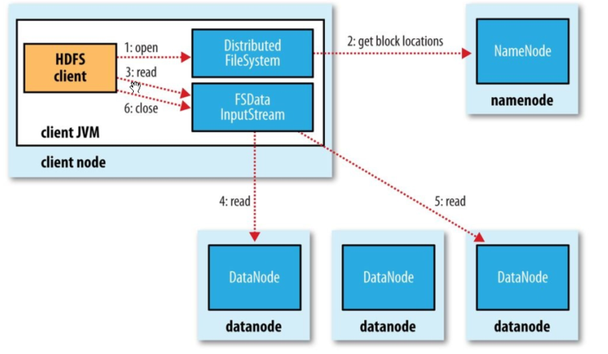

MapReduce
====
> 场景：气象台收集全国各地的气象信息，气象信息原本以格式化的记录形式存储在官方系统中，我们需要处理这些数据

MapReduce任务分为两个阶段，map和reduce，每个阶段都以键值对作为输入和输出。

map阶段：

气象信息的原始数据 --map--> 年份，气温 

reduce阶段：

年份，气温  --reduce--> 最高气温

JavaMapReduce:

```java
public class TestMapper extends Mapper<LongWritable, Text,Text, IntWritable> {
    @Override
    protected void map(LongWritable key, Text value, Context context) throws IOException, InterruptedException {
        String line = value.toString();
        String year = line.substring(1,5);
        int temperature = Integer.parseInt(line.substring(6,10));
        //context写入
        context.write(new Text(year),new IntWritable(temperature));
    }
}
```
Mapper<LongWritable, Text, NullWritable, Text>

Mapper范型类，四个参数分别为，入参键，入参值，输出键，输出值。（hadoop本身提供了一套可优化网络序列化传输的基本类型，不使用java基本类型，LongWritable->long;Text->String）
map方法，两个参数为，入参键和入参值，还提供context实例用于输出内容的写入。

```java
public class TestReduce extends Reducer<Text, IntWritable,Text,IntWritable> {
    @Override
    protected void reduce(Text key, Iterable<IntWritable> values, Context context) throws IOException, InterruptedException {
        //map key dosomething,value dosomething 注意这里的参数为map的输出类型
        int finalInt = 0;
        for (IntWritable x: values) {
            finalInt = x.get()+1;
        }
        context.write(key,new IntWritable(finalInt));
    }
}
```
Reduce范型类参数类型与Mapper描述的相同，需要注意的是输入类型需要匹配mapper的输出类型。

运行MapReduce：
```java
public class TestJob {
    public static void main(String[] args) throws IOException, ClassNotFoundException, InterruptedException {
        Job job = Job.getInstance();
        //important: (使之可以在集群上执行)Set the Jar by finding where a given class came from.
        job.setJarByClass(TestJob.class);
        job.setJobName("job_name");

        //inputs for the map-reduce job.
        FileInputFormat.addInputPath(job,new Path(args[0]));
        //the output directory for the map-reduce job.
        FileOutputFormat.setOutputPath(job,new Path(args[1]));

        //配置mapper和reduce执行类
        job.setMapperClass(TestMapper.class);
        job.setReducerClass(TestReduce.class);

        //设置reduce类型输出
        job.setOutputKeyClass(Text.class);
        job.setOutputValueClass(IntWritable.class);

        System.exit(job.waitForCompletion(true)?0:1);

    }
}
```

mapreduce执行：<br>
```java
//加载hadoop类库
export HADOOP_CLASSPATH=hadoop.jar
//第一个参数为类名，hadoop会开启一个jvm来运行这个类
hadoop TestJob input.txt output
```
job执行结束后，会在output目录下生成reduce任务数量个part-r-xxxx文件

mapreduce过程：


当数据量比较多时，hadoop对输入数据进行分片，切分为等长的数据段(一般取hdfs一个块的128M)，再将这些分片交由集群中不同节点上的任务(mapreduce)去执行。<br>
map函数将处理后数据写入本地磁盘，shuffer数据，网络传输给其他机器后merge，交由reduce函数处理，最终写入hdfs。所以集群带宽实际上限制了mapreduce的作业量。

所以为了有效的使用带宽，可以进行combiner操作，如获取最高气温这个例子，每个map任务都返回了一组气温，那么是不是可以让一个函数先过滤出最高气温，再进行reduce呢。这就是combiner函数了。
定义combiner函数与reduce函数一样，只不过需要在job中(map后，reduce前)设置combiner类。
```java
job.setCombinerClass(conbiner.class)
```

对于输出结果的压缩。
```java
FileOutputFormat.setCompressOutPut(job,true);
FileOutputFormat.setOutputCompressClass(job,GzipCodec.class);
```

为了更方便的进行作业，可以使用Tool接口以及ToolRunner类。

实现Tool接口，使用ToolRunner运行应用程序
```java
public class ToolTest extends Configured implements Tool {
    /**
     * important:所有实现Tool接口的类也都必须实现Configurable 因为Tool继承Configurable
     * 这里继承了Configured，但你完全可以自定义一个Configurable，或者就在这里写方法实现
     */
    static {
        Configuration.addDefaultResource("hdfs.xml");
    }

    public int run(String[] args) throws Exception {
        Configuration conf = getConf();
        /**
         * 将TestJob中的main方法copy进来即可直接执行上面写的mr任务了，job配置使用getConf的返回即可
         */
        return 0;
    }

    public static void main(String[] args) throws Exception {
        ToolRunner.run(new ToolTest(),args);

    }
}
```

程序打包，Hadoop会自动寻找包含JobConf或者Job.setJarByClass的类。
hadoop -jar hadoop-example.jar xxx.xxx.ToolTest -conf 指定集群 input/xxx/all max-temp

HDFS
====


```java
public class FilesTest{
    //读取hadoop文件系统
    public void read(){
        Configuration conf = new Configuration();
        FileSystem fs = null;
        FSDataInputStream in = null;
        try {
            fs = FileSystem.get(URI.create("hdfs://lbc/haha"),conf);

        //这个类实现了Seekable Positionable等接口，可以从流的任意位置读取
        in= fs.open(new Path("hdfs://lbc/haha"));

        IOUtils.copyBytes(in,System.out,4096,false);
        in.seek(0);
        IOUtils.copyBytes(in,System.out,4096,false);
        } catch (Exception e) {
            e.printStackTrace();
        }finally {
            IOUtils.closeStream(in);
        }
    }

    //写入hadoop文件系统
    public void write() throws Exception{
        Configuration conf = new Configuration();
        FileSystem fs = null;
        InputStream in = new BufferedInputStream(new FileInputStream("/lbc/hahaha.txt"));

        FSDataOutputStream out = fs.create(new Path("dst path"), new Progressable() {
            //回调 数据写入datanode的消息告知应用
            public void progress() {
                System.out.println("完成");
            }
        });
        IOUtils.copyBytes(in,out,4096,false);
    }
}
```

Hbase
====